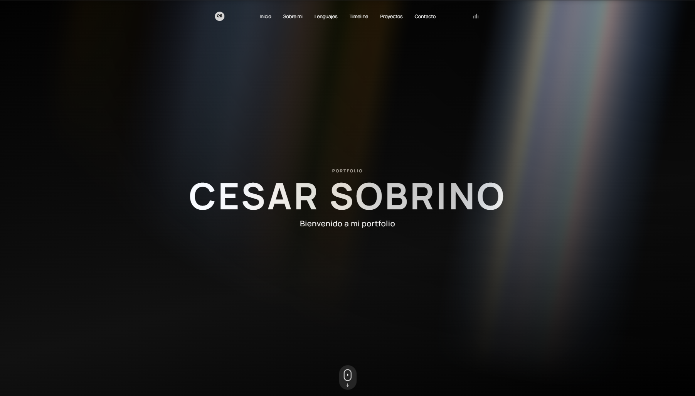

# Cesar Sobrino | Portfolio



Portfolio personal desarrollado con Angular, orientado a mostrar perfil profesional, experiencia, stack técnico y proyectos mediante una navegación visual por secciones.

## Secciones de la web

- Header: Hero de entrada con navegación fija, menú responsive y accesos rápidos por anclas.
- Sobre mí: Presentación personal con resumen técnico.
- Lenguajes: Tecnologías y herramientas principales que utilizo.
- Timeline: Recorrido académico y profesional con efectos de scroll.
- Proyectos: Sección interactiva con nodos conectados, contenido ampliable y previews en video.
- Contacto: Cierre con correo, enlaces sociales y descarga de CV.
- Footer: Pie minimalista con información final.

## Stack utilizado

- Angular 21
- TypeScript
- CSS personalizado
- @omnedia/ngx-aurora
- @omnedia/ngx-typewriter
- @omnedia/ngx-marquee
- @omnedia/ngx-tracing-beam
- @omnedia/ngx-timeline
- @omnedia/ngx-connection-beam

## Contacto

- Email: cesarsobrinoarribas@gmail.com
- GitHub: https://github.com/Zetasab
- LinkedIn: https://www.linkedin.com/in/cesar-sobrino-arribas-1b887021b/
- Instagram: https://www.instagram.com/zetasaab/
- CV: public/Cesar_SobrinoArribas_CV.pdf

## Estructura del proyecto

```text
public/
	Portada.png
	logo.png
	visit-tracker.js
	Cesar_SobrinoArribas_CV.pdf

src/
	app/
		sections/
			header/
			about/
			languages/
			timeline/
			projects/
			contact/
```

## Ejecutar en local

1. Instalar dependencias:

```bash
npm install
```

2. Levantar entorno de desarrollo:

```bash
npm run start
```

3. Abrir en navegador:

```text
http://localhost:4200
```

## Scripts disponibles

```bash
npm run start   # arranca en desarrollo
npm run build   # genera build de producción
npm run test    # ejecuta tests
```

## Ejecutar con Docker

Requisitos:

- Docker Desktop instalado

Construir imagen:

```bash
docker build -t ng-cesarsobrino .
```

Ejecutar contenedor:

```bash
docker run -d --name ng-cesarsobrino-web -p 8080:80 ng-cesarsobrino
```

Abrir en navegador:

```text
http://localhost:8080
```

Con Docker Compose:

```bash
docker compose up -d --build
```

Parar y eliminar:

```bash
docker compose down
```

## Nota

- Si no ves cambios en assets o scripts estáticos, haz una recarga forzada con Ctrl+F5.
